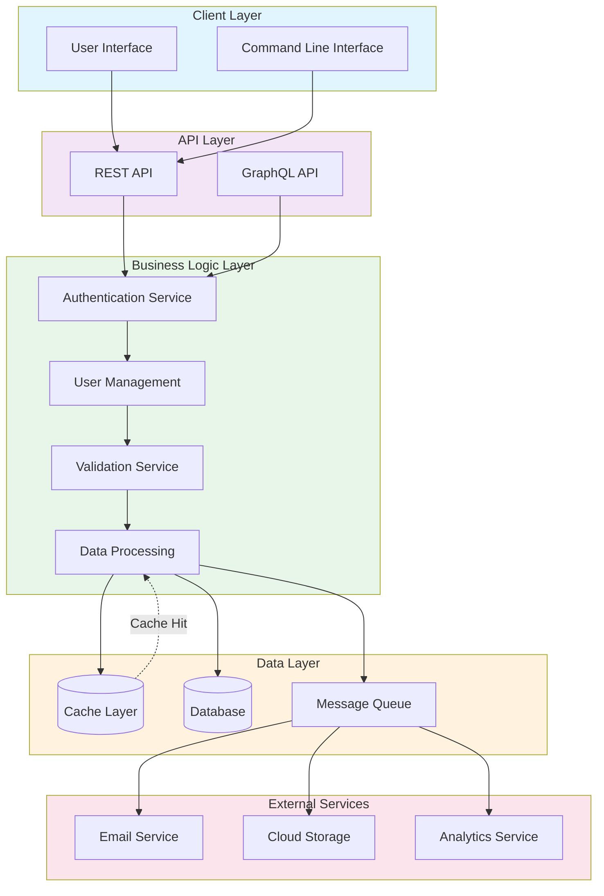

# System Architecture Overview

## Architecture Diagram

## Architecture Components

### Client Layer
- **User Interface**: Web/Mobile frontend application
- **Command Line Interface**: CLI tools for direct system access

### API Layer
- **REST API**: Traditional HTTP-based API endpoints
- **GraphQL API**: Modern query-based API interface

### Business Logic Layer
- **Authentication Service**: Handles user authentication and authorization
- **User Management**: Manages user profiles and permissions
- **Data Processing**: Core business logic and data transformation
- **Validation Service**: Validates incoming requests and data

### Data Layer
- **Cache Layer**: In-memory caching for performance optimization
- **Database**: Persistent data storage
- **Message Queue**: Asynchronous task processing

### External Services
- **Email Service**: Email delivery and notifications
- **Cloud Storage**: File and object storage
- **Analytics Service**: Tracking and analytics

## Key Features

- **Separation of Concerns**: Each layer has distinct responsibilities
- **Scalability**: Modular design allows independent scaling
- **Maintainability**: Clear structure makes code easier to maintain
- **Flexibility**: Multiple API options for different client needs
- **Asynchronous Processing**: Queue-based architecture for background tasks
- **Performance**: Caching layer reduces database load
